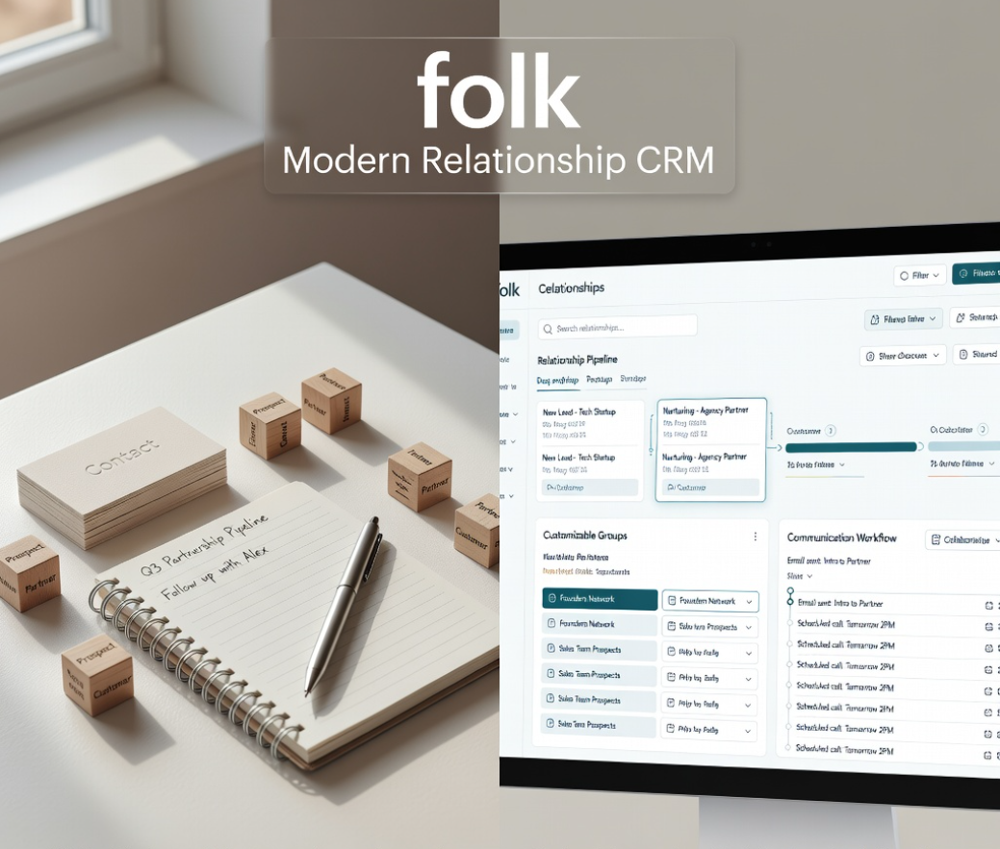
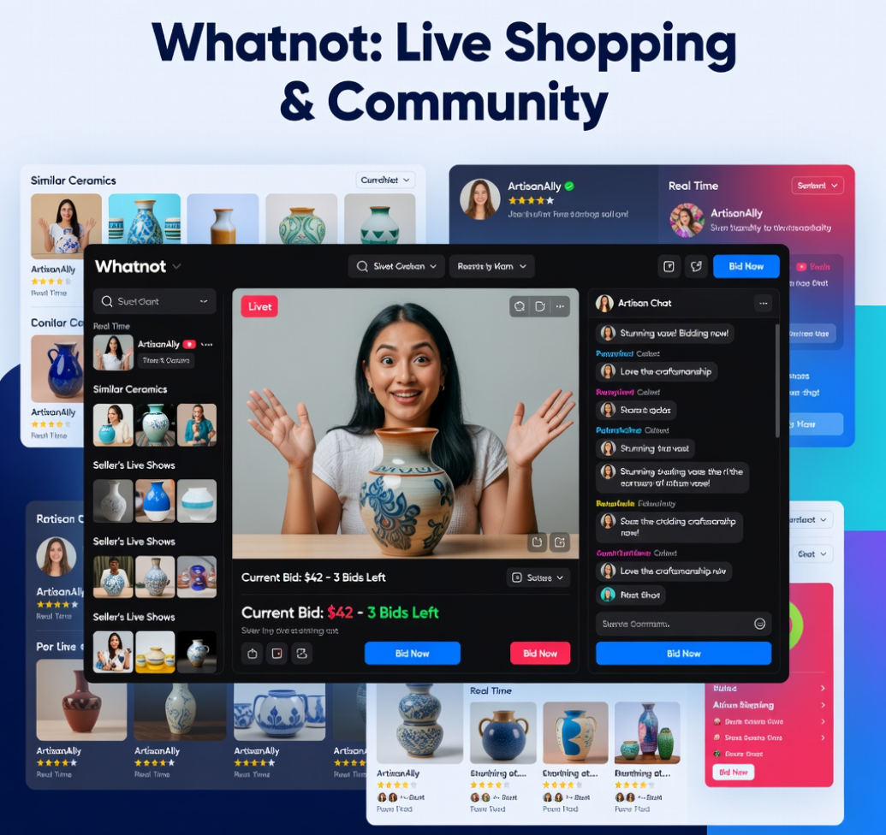
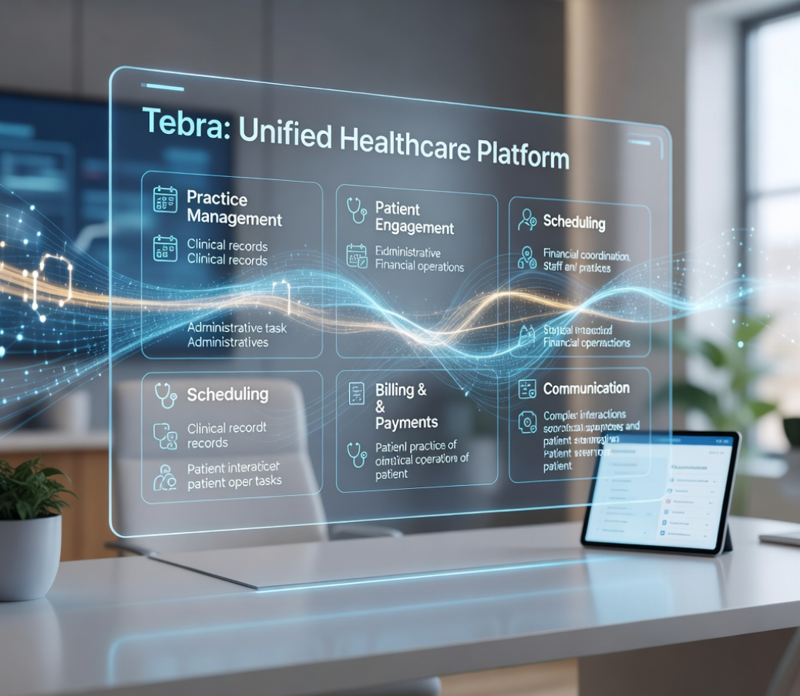

<!-- ========================================================= -->
<!--                    ANTON KARAS README                     -->
<!-- ========================================================= -->

  

# My Portfolio

*Welcome to my portfolio.*
*I build **scalable web applications, robust backend systems, blockchain solutions, and AI-powered software** with a focus on clean architecture, performance, security, and modern user experiences.*

## Featured Projects

<table>
<tr>

<!-- ========================================================= -->
<!-- PROJECT 1 -->
<!-- ========================================================= -->

<td width="50%" valign="top">

<h3 align="center">01. QloApps</h3>

  

Open-source hotel-management and reservation platform covering PMS, online booking, hotel websites, and channel management. Supports hotel operations such as reservations, room inventory, front-desk management, revenue management, POS, and reporting.

  <code>Full-Stack Web Application</code>
  <code>Booking &amp; Reservation</code>
  <code>PMS</code>
  <code>Channel Management</code>
  <code>Revenue Management</code>

  <a href="https://qloapps.com/">
    🔗 <strong>VIEW LIVE PROJECT</strong>
  </a>

</td>

<!-- ========================================================= -->
<!-- PROJECT 2 -->
<!-- ========================================================= -->

<td width="50%" valign="top">

<h3 align="center">02. LittleAIBox</h3>

  

Privacy-focused AI chat platform providing AI-assisted conversations, coding, writing, translation, and research tools. Includes task presets, customizable AI parameters, conversation management, API-key configuration, and subscription features.

  <code>AI-Powered Application</code>
  <code>LLM Integration</code>
  <code>Conversational AI</code>
  <code>API Configuration</code>
  <code>Subscription Features</code>

  <a href="https://littleaibox.com/">
    🔗 <strong>VIEW LIVE PROJECT</strong>
  </a>

</td>

</tr>

<tr>

<!-- ========================================================= -->
<!-- PROJECT 3 -->
<!-- ========================================================= -->

<td width="50%" valign="top">

<h3 align="center">03. Paradex</h3>

  

Decentralized trading platform combining blockchain technology with a high-performance exchange experience. Supports perpetual futures, options, spot trading, unified margin, real-time markets, and REST/WebSocket APIs.

  <code>Blockchain/Web3</code>
  <code>Real-Time Web Application</code>
  <code>Paradex Trading App</code>
  <code>WebSocket APIs</code>
  <code>Perpetual Futures</code>

  <a href="https://www.paradex.trade/">
    🔗 <strong>VIEW LIVE PROJECT</strong>
  </a>

</td>

<!-- ========================================================= -->
<!-- PROJECT 4 -->
<!-- ========================================================= -->

<td width="50%" valign="top">

<h3 align="center">04. DentalPin</h3>

  

Dental-clinic management application designed to manage patients, appointments, budgets, payments, and day-to-day clinic operations. Provides an integrated business dashboard for organizing clinical records, scheduling, financial information, and practice workflows.

  <code>Healthcare Management</code>
  <code>Database &amp; API Integration</code>
  <code>Patient Management</code>
  <code>Scheduling</code>
  <code>Financial Workflows</code>

  <a href="https://demo.dentalpin.com/login">
    🔗 <strong>VIEW LIVE PROJECT</strong>
  </a>

</td>

</tr>

<tr>

<!-- ========================================================= -->
<!-- PROJECT 5 -->
<!-- ========================================================= -->

<td width="50%" valign="top">

<h3 align="center">05. V7 Labs</h3>

  

AI platform for document processing, computer vision, medical AI, and intelligent data extraction. Provides automated workflows for turning complex visual and unstructured data into usable information.

  <code>AI Platform</code>
  <code>Computer Vision</code>
  <code>Document Processing</code>
  <code>Medical AI</code>
  <code>Data Extraction</code>

  <a href="https://www.v7labs.com/">
    🔗 <strong>VIEW LIVE PROJECT</strong>
  </a>

</td>

<!-- ========================================================= -->
<!-- PROJECT 6 -->
<!-- ========================================================= -->

<td width="50%" valign="top">

<h3 align="center">06. folk</h3>

  

Relationship-focused CRM designed for founders, agencies, sales teams, and growing businesses. Combines contact management, relationship tracking, pipelines, communication, and customizable workflows.

  <code>CRM</code>
  <code>Contact Management</code>
  <code>Sales Pipelines</code>
  <code>Relationship Tracking</code>
  <code>Workflow Automation</code>

  <a href="https://www.folk.app/">
    🔗 <strong>VIEW LIVE PROJECT</strong>
  </a>

</td>

</tr>

<tr>

<!-- ========================================================= -->
<!-- PROJECT 7 -->
<!-- ========================================================= -->

<td width="50%" valign="top">

<h3 align="center">07. Whatnot</h3>

  

Live-shopping marketplace where sellers showcase products through interactive livestreams. Combines e-commerce, live video, auctions, community interaction, and social product discovery.

  <code>E-Commerce</code>
  <code>Live Streaming</code>
  <code>Marketplace</code>
  <code>Auctions</code>
  <code>Social Commerce</code>

  <a href="https://www.whatnot.com/">
    🔗 <strong>VIEW LIVE PROJECT</strong>
  </a>

</td>

<!-- ========================================================= -->
<!-- PROJECT 8 -->
<!-- ========================================================= -->

<td width="50%" valign="top">

<h3 align="center">08. Tebra</h3>

  

Healthcare practice-management platform for medical practices and healthcare providers. Supports patient management, scheduling, billing, payments, communication, and other clinical business workflows.

  <code>Healthcare Management</code>
  <code>Practice Management</code>
  <code>Patient Scheduling</code>
  <code>Billing &amp; Payments</code>
  <code>Clinical Workflows</code>

  <a href="https://www.tebra.com/">
    🔗 <strong>VIEW LIVE PROJECT</strong>
  </a>

</td>

</tr>
</table>

  
  

  
  <picture>
    <source media="(prefers-color-scheme: dark)" srcset="https://raw.githubusercontent.com/saiharsha3377/saiharsha3377/output/pacman-contribution-graph-dark.svg">
    <source media="(prefers-color-scheme: light)" srcset="https://raw.githubusercontent.com/saiharsha3377/saiharsha3377/output/pacman-contribution-graph.svg">
    
  </picture>
  
   
  
  
  

