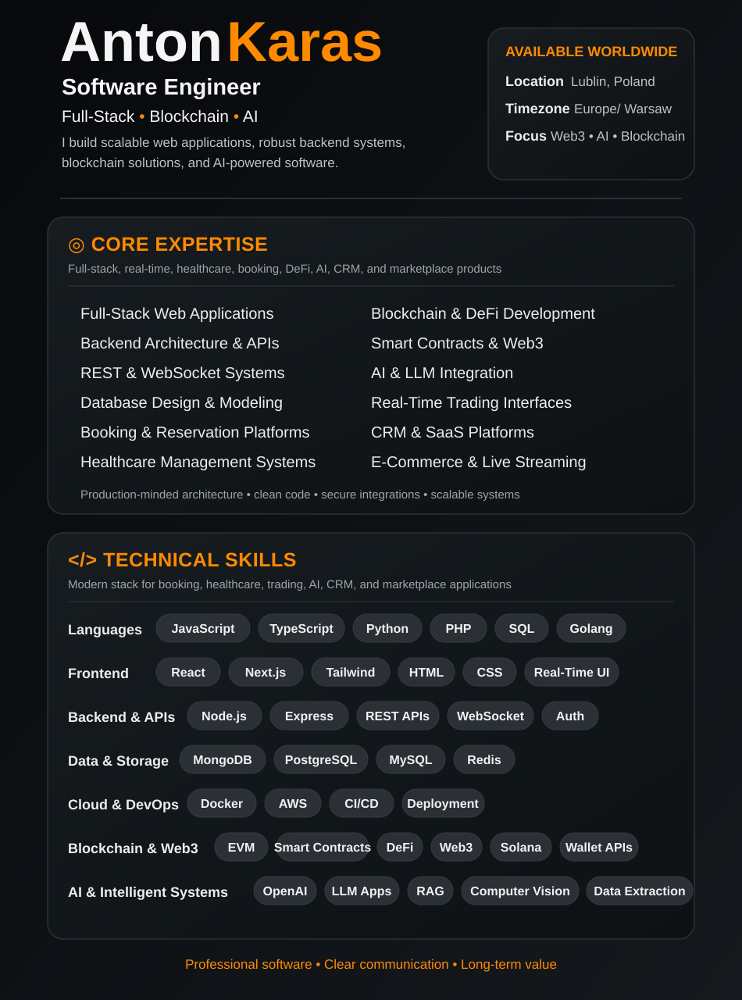
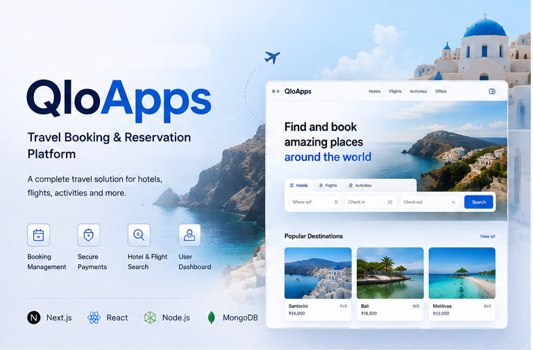
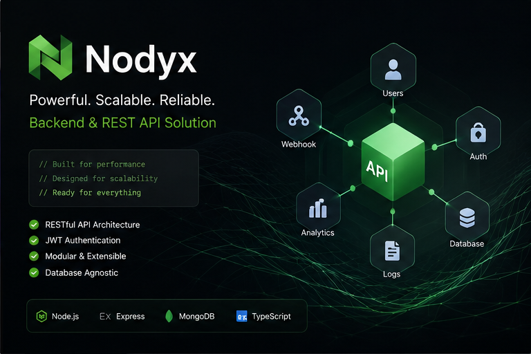
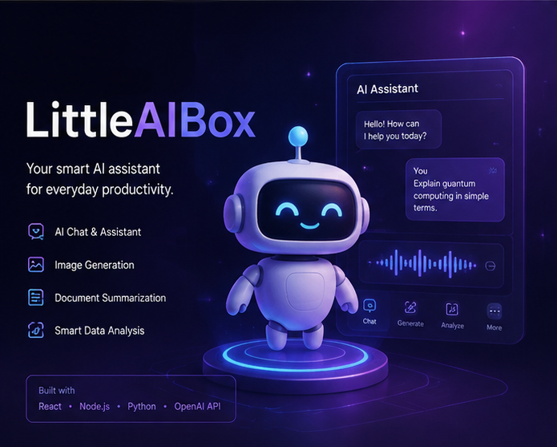
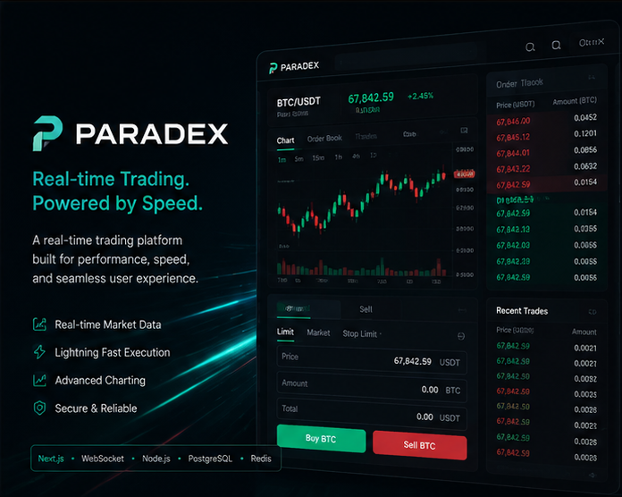
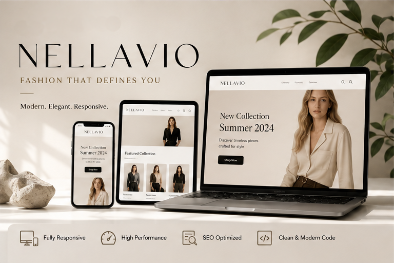

<!-- ========================================================= -->
<!--                    ANTON KARAS README                     -->
<!-- ========================================================= -->

  

# Featured Portfolio

*Welcome to my portfolio.*
*I build **scalable web applications, robust backend systems, blockchain solutions, and AI-powered software** with a focus on clean architecture, performance, security, and modern user experiences.*

## Featured Projects

<table>
<tr>

<!-- ========================================================= -->
<!-- PROJECT 1 -->
<!-- ========================================================= -->

<td width="50%" valign="top">

<h3 align="center">QloApps</h3>

  

A complete hotel-management and online booking platform supporting room management, reservations, customer accounts, pricing, and booking workflows. Demonstrates the ability to build a complex full-stack business application with multiple interconnected modules.

  <code>HTML5</code>
  <code>CSS3</code>
  <code>PHP</code>
  <code>MySQL</code>
  <code>CSS3</code>
  <code>Authentication</code>
  <code>Payment Integration</code>
  <code>Booking Systems</code>
  <code>Payment Integration</code>

  <a href="https://qloapps.com/">
    🔗 <strong>VIEW LIVE PROJECT</strong>
  </a>

</td>

<!-- ========================================================= -->
<!-- PROJECT 2 -->
<!-- ========================================================= -->

<td width="50%" valign="top">

<h3 align="center">Nodyx CRM</h3>

  

A self-hosted community and social platform with a modern backend architecture designed for scalable user interactions and content management. Demonstrates backend engineering, API development, authentication, data processing, and service integration.

  <code>JavaScript</code>
  <code>Rust</code>
  <code>Node.js</code>
  <code>REST API</code>
  <code>Authentication</code>
  <code>Server Architecture</code>
  <code>Database Modeling</code>
  <code>Security</code>

  <a href="https://nodyx.org/">
    🔗 <strong>VIEW LIVE PROJECT</strong>
  </a>

</td>

</tr>

<tr>

<!-- ========================================================= -->
<!-- PROJECT 3 -->
<!-- ========================================================= -->

<td width="50%" valign="top">

<h3 align="center">LittleAIBox</h3>

  

A privacy-focused AI application providing a unified interface for interacting with modern AI models. Demonstrates AI integration, conversational interfaces, model management, secure API communication, and modern web application development.

  <code>React</code>
  <code>TypeScript</code>
  <code>Python/Node.js</code>
  <code>REST APIs</code>
  <code>AI API Integration</code>
  <code>LLM Integration</code>
  <code>Model Management</code>

  <a href="https://github.com/LittleAIBox/LittleAIBox">
    🔗 <strong>VIEW LIVE PROJECT</strong>
  </a>

</td>

<!-- ========================================================= -->
<!-- PROJECT 4 -->
<!-- ========================================================= -->

<td width="50%" valign="top">

<h3 align="center">Paradex</h3>

  

  A real-time decentralized trading platform designed for high-frequency market interaction and live financial data. Demonstrates real-time communication, trading interfaces, WebSocket data streams, API integration, and blockchain-based application architecture.

  <code>React</code>
  <code>TypeScript</code>
  <code>Next.js</code>
  <code>Tailwind CSS</code>
  <code>REST API/WebSocket</code>
  <code>Real-Time Data Processing</code>
  <code>Next.js</code>
  <code>Smart Contracts</code>
  <code>...</code>

  <a href="https://www.paradex.trade/">
    🔗 <strong>VIEW PROJECT</strong>
  </a>

</td>

</tr>

<tr>

<!-- ========================================================= -->
<!-- PROJECT 5 -->
<!-- ========================================================= -->

<td width="50%" valign="top">

<h3 align="center">Horilla HR</h3>

  

  A comprehensive human-resource management platform covering employees, attendance, leave, recruitment, payroll, performance, and organizational workflows. Demonstrates the ability to develop large-scale business software with complex permissions and interconnected modules.

  <code>Python</code>
  <code>Django</code>
  <code>REST APIs</code>
  <code>PostgreSQL</code>
  <code>RBAC</code>
  <code>Authentication</code>
  <code>HR Management</code>
  <code>Business Workflows</code>

  <a href="https://www.horilla.com/">
    🔗 <strong>VIEW PROJECT</strong>
  </a>

</td>

<!-- ========================================================= -->
<!-- PROJECT 6 -->
<!-- ========================================================= -->

<td width="50%" valign="top">

<h3 align="center">Beefy Finance</h3>

  

 A decentralized yield-optimization platform that automates strategies for users across blockchain networks. Demonstrates practical Web3 development involving smart contracts, DeFi protocols, blockchain interactions, wallets, and automated financial strategies.

  <code>React</code>
  <code>JavaScript</code>
  <code>TypeScript</code>
  <code>Node.js</code>
  <code>Solidity</code>
  <code>Smart Contracts</code>
  <code>EVM</code>
  <code>Transaction Management</code>
  <code>Security</code>

  <a href="https://beefy.com/">
    🔗 <strong>VIEW PROJECT</strong>
  </a>

</td>

</tr>

<tr>

<!-- ========================================================= -->
<!-- PROJECT 7 -->
<!-- ========================================================= -->

<td width="50%" valign="top">

<h3 align="center">Nellavio</h3>

  

A modern, responsive web interface focused on polished visual presentation, reusable components, and seamless experiences across desktop, tablet, and mobile devices. Demonstrates strong frontend engineering and UI implementation skills.

  <code>React</code>
  <code>TypeScript</code>
  <code>Tailwind CSS</code>
  <code>UI/UX Implementation</code>
  <code>Framer Motion</code>
  <code>Accessibility</code>
  <code>Cross-Browser Compatibility</code>

  <a href="https://nellavio.com/">
    🔗 <strong>VIEW PROJECT</strong>
  </a>

</td>

<!-- ========================================================= -->
<!-- PROJECT 8 -->
<!-- ========================================================= -->

<td width="50%" valign="top">

<h3 align="center">DentalPin</h3>

  

  A dental-focused web application that combines structured patient and dental data with API-driven application workflows. It demonstrates practical database architecture, secure data management, API integration, and responsive interfaces for managing healthcare-related information.

  <code>React</code>
  <code>TypeScript</code>
  <code>Node.js</code>
  <code>API Integration</code>
  <code>PostgreSQL</code>
  <code>Data Modeling</code>
  <code>Search & Filtering</code>
  <code>Third-Party API</code>

  <a href="https://dentalpin.com/">
    🔗 <strong>VIEW PROJECT</strong>
  </a>

</td>

</tr>
</table>

  
  

  
  <picture>
    <source media="(prefers-color-scheme: dark)" srcset="https://raw.githubusercontent.com/saiharsha3377/saiharsha3377/output/pacman-contribution-graph-dark.svg">
    <source media="(prefers-color-scheme: light)" srcset="https://raw.githubusercontent.com/saiharsha3377/saiharsha3377/output/pacman-contribution-graph.svg">
    
  </picture>
  
   
  
  
  

