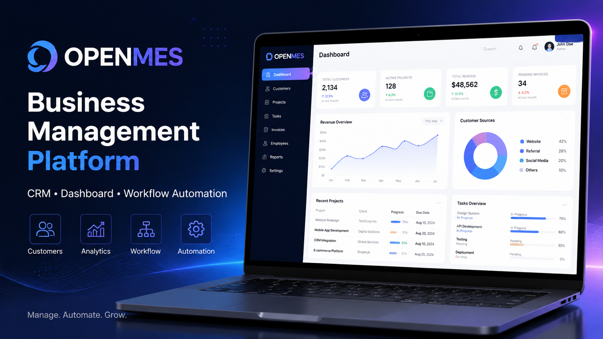
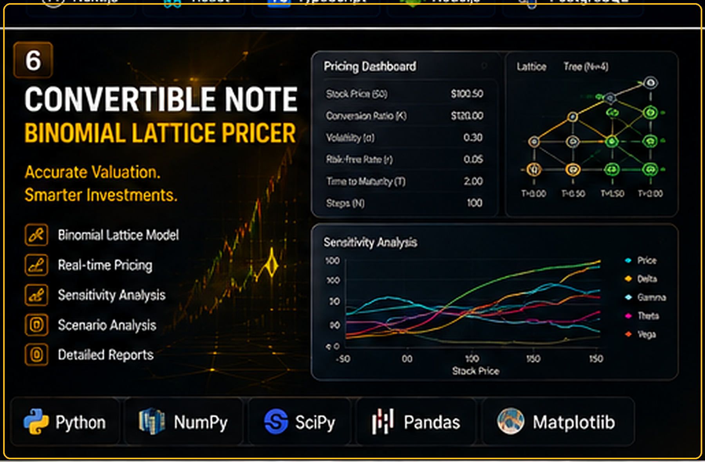
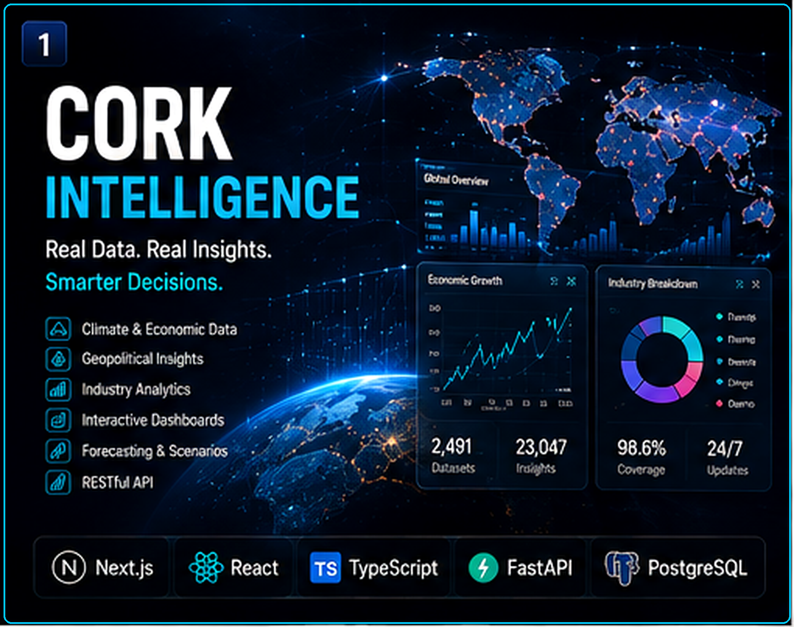
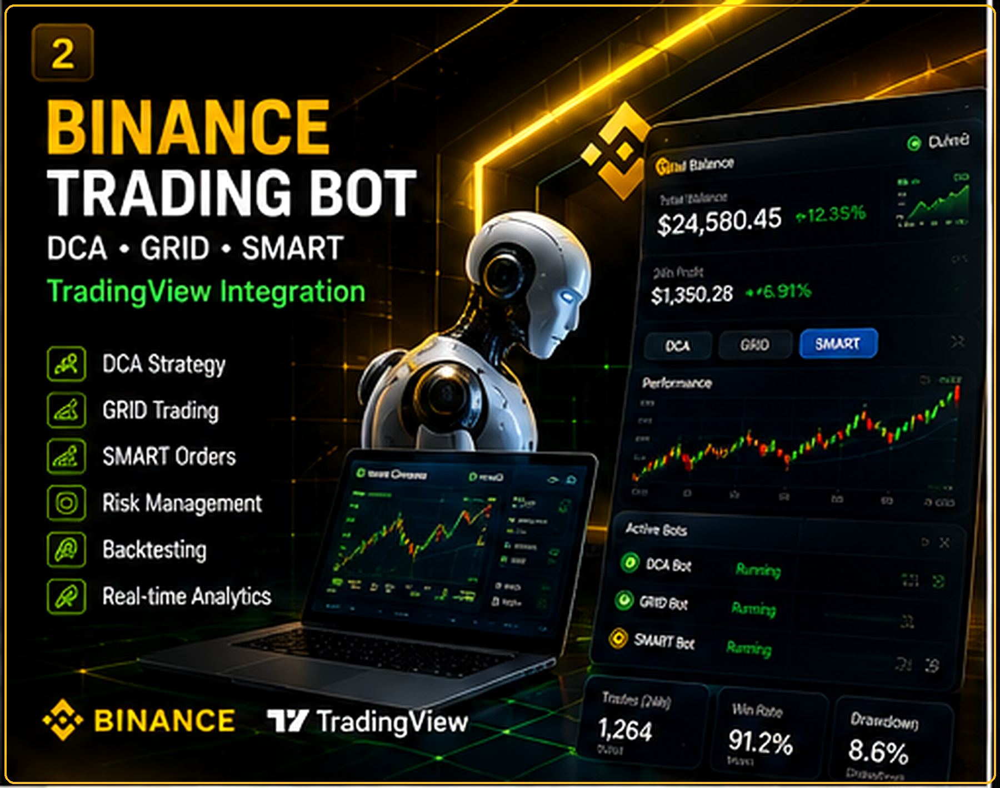
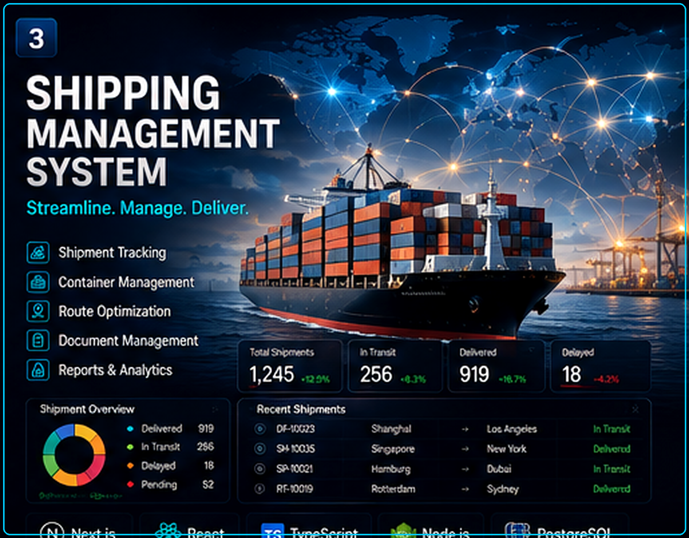
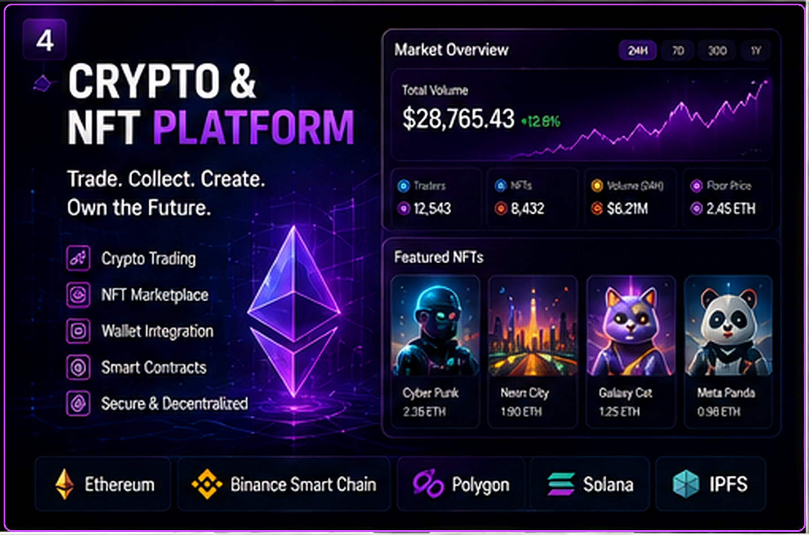
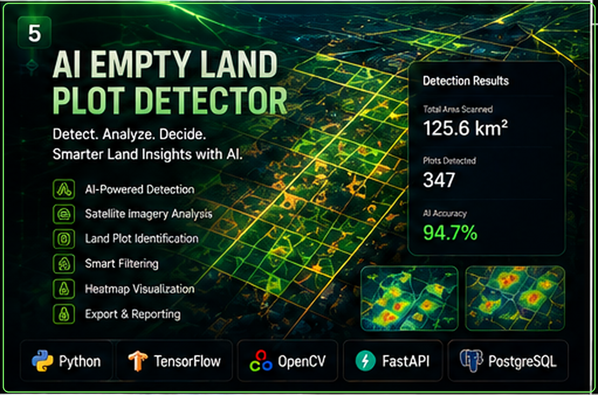

<!-- ========================================================= -->
<!--                    ANTON KARAS README                     -->
<!-- ========================================================= -->

  

# Featured Portfolio

*Welcome to my portfolio.*
*I build **scalable web applications, robust backend systems, blockchain solutions, and AI-powered software** with a focus on clean architecture, performance, security, and modern user experiences.*

## Featured Projects

<table>
<tr>

<!-- ========================================================= -->
<!-- PROJECT 1 -->
<!-- ========================================================= -->

<td width="50%" valign="top">

<h3 align="center">OpenMES</h3>

  

  Business management and manufacturing platform designed to manage
  production, operations, inventory, and business workflows.

  <code>React</code>
  <code>Node.js</code>
  <code>PostgreSQL</code>
  <code>Docker</code>

  <a href="https://demo.getopenmes.com/">
    🔗 <strong>VIEW LIVE PROJECT</strong>
  </a>

</td>

<!-- ========================================================= -->
<!-- PROJECT 2 -->
<!-- ========================================================= -->

<td width="50%" valign="top">

<h3 align="center">Horilla CRM</h3>

  

  Modern CRM platform for managing customers, employees,
  business workflows, and organizational operations.

  <code>Python</code>
  <code>Django</code>
  <code>PostgreSQL</code>
  <code>JavaScript</code>

  <a href="https://crm.demo.horilla.com/">
    🔗 <strong>VIEW LIVE PROJECT</strong>
  </a>

</td>

</tr>

<tr>

<!-- ========================================================= -->
<!-- PROJECT 3 -->
<!-- ========================================================= -->

<td width="50%" valign="top">

<h3 align="center">Frappe CRM</h3>

  

  Modern CRM solution focused on customer relationships,
  sales workflows, communication, and business productivity.

  <code>Python</code>
  <code>Frappe</code>
  <code>REST API</code>
  <code>MariaDB</code>

  <a href="https://frappe.io/crm">
    🔗 <strong>VIEW LIVE PROJECT</strong>
  </a>

</td>

<!-- ========================================================= -->
<!-- PROJECT 4 -->
<!-- ========================================================= -->

<td width="50%" valign="top">

<h3 align="center">CORK Intelligence</h3>

  

  Intelligent analytics and business dashboard focused on
  data visualization, insights, and decision support.

  <code>React</code>
  <code>TypeScript</code>
  <code>Node.js</code>
  <code>Analytics</code>

  <a href="YOUR_CORK_PROJECT_URL">
    🔗 <strong>VIEW PROJECT</strong>
  </a>

</td>

</tr>

<tr>

<!-- ========================================================= -->
<!-- PROJECT 5 -->
<!-- ========================================================= -->

<td width="50%" valign="top">

<h3 align="center">Binance Trading Bot</h3>

  

  Automated cryptocurrency trading platform supporting
  DCA, GRID, SMART strategies and TradingView integration.

  <code>Node.js</code>
  <code>TypeScript</code>
  <code>Binance API</code>
  <code>TradingView</code>

  <a href="YOUR_TRADING_BOT_URL">
    🔗 <strong>VIEW PROJECT</strong>
  </a>

</td>

<!-- ========================================================= -->
<!-- PROJECT 6 -->
<!-- ========================================================= -->

<td width="50%" valign="top">

<h3 align="center">Shipping Management</h3>

  

  End-to-end shipping and logistics management solution
  for tracking operations, shipments, and business workflows.

  <code>React</code>
  <code>Node.js</code>
  <code>MongoDB</code>
  <code>REST API</code>

  <a href="YOUR_SHIPPING_PROJECT_URL">
    🔗 <strong>VIEW PROJECT</strong>
  </a>

</td>

</tr>

<tr>

<!-- ========================================================= -->
<!-- PROJECT 7 -->
<!-- ========================================================= -->

<td width="50%" valign="top">

<h3 align="center">Crypto & NFT Platform</h3>

  

  Web3 platform combining cryptocurrency functionality,
  NFT technology, wallets, blockchain interactions, and APIs.

  <code>React</code>
  <code>TypeScript</code>
  <code>EVM</code>
  <code>Web3</code>
  <code>Smart Contracts</code>

  <a href="YOUR_CRYPTO_PROJECT_URL">
    🔗 <strong>VIEW PROJECT</strong>
  </a>

</td>

<!-- ========================================================= -->
<!-- PROJECT 8 -->
<!-- ========================================================= -->

<td width="50%" valign="top">

<h3 align="center">AI Empty Land Plot Detector</h3>

  

  AI-powered computer vision solution for identifying
  and analyzing empty land plots from imagery and geospatial data.

  <code>Python</code>
  <code>AI</code>
  <code>Computer Vision</code>
  <code>Machine Learning</code>

  <a href="YOUR_AI_PROJECT_URL">
    🔗 <strong>VIEW PROJECT</strong>
  </a>

</td>

</tr>
</table>

  
  

  
  <picture>
    <source media="(prefers-color-scheme: dark)" srcset="https://raw.githubusercontent.com/saiharsha3377/saiharsha3377/output/pacman-contribution-graph-dark.svg">
    <source media="(prefers-color-scheme: light)" srcset="https://raw.githubusercontent.com/saiharsha3377/saiharsha3377/output/pacman-contribution-graph.svg">
    
  </picture>
  
   
  
  
  

